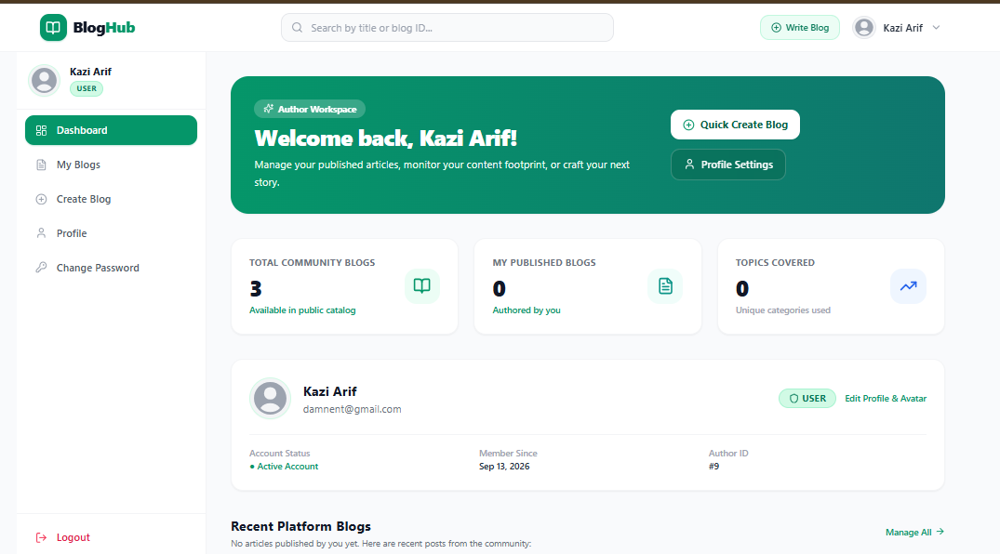

# BlogHub — Blog Management Application

A full-stack blog platform built for the **Batch 19 Frontend Development Assignment: Blog Management Application with Next.js**. The project pairs a responsive Next.js frontend with an Express, MySQL, and Sequelize REST API. It supports public blog discovery, authenticated author workflows, and administrator user management.

The frontend was added to the existing backend project and consumes the REST API for all application data—there are no mock users, hard-coded blog lists, frontend-only authentication, or direct database calls from the UI.

**Repository:** [kaziarif1/blog-management-application](https://github.com/kaziarif1/blog-management-application)

## Features

### Guest experience

- Browse published blogs and open individual blog-detail pages.
- Search blogs by title and filter them by category; both filters can be used together.
- Register, log in, request a password-reset link, and reset a password from the email token URL.

### Authenticated user experience

- Persistent JWT-backed session with automatic profile loading and protected-route redirects.
- Dashboard with profile summary, blog statistics, recent posts, and a quick-create action.
- Create, view, edit, and delete owned blogs, with confirmation before deletion.
- Update first and last name, upload a profile image, and change password.
- Responsive dashboard navigation, fixed top navigation, profile/avatar menu, loading states, alerts, validation, and empty states.

### Administrator experience

- See all blogs and edit or delete any user's blog, as authorized by the API.
- View users, inspect user details, and activate or deactivate accounts.
- Admin-only navigation and client-side route guarding, backed by API authorization.

## Tech Stack

| Area | Technologies |
| --- | --- |
| Frontend | Next.js 14 (App Router), React 18, Tailwind CSS, Lucide React |
| Backend | Node.js, Express 5, Sequelize |
| Database | MySQL |
| Security | JWT, bcrypt, role-based authorization |
| Uploads & email | Multer, Nodemailer |
| API testing | Postman |

## Project Structure

```text
blog-management-application/
├── blog-api/                    # Existing Express REST API
│   ├── controller/               # Auth, user, and blog controllers
│   ├── middlewares/              # JWT, admin, and image-upload middleware
│   ├── models/                   # Sequelize User and Blog models
│   ├── routes/                   # REST API endpoints
│   ├── services/                 # Business logic
│   └── postman/                  # Importable API collection
├── blog-frontend/                # Next.js + Tailwind frontend
│   └── src/
│       ├── app/                  # App Router pages and layouts
│       ├── components/           # Reusable UI components
│       ├── contexts/             # Authentication state
│       ├── services/             # Auth, user, and blog API services
│       └── utils/                # API client, auth, and formatters
├── screenshot/                   # Application screenshots
└── Blog-Management-API.postman_collection.json
```

## Prerequisites

- Node.js 18 or newer
- npm
- MySQL server

## Installation and Setup

1. Clone the repository and install the backend dependencies.

   ```bash
   git clone https://github.com/kaziarif1/blog-management-application.git
   cd blog-management-application/blog-api
   npm install
   ```

2. Create the database.

   ```sql
   CREATE DATABASE blogdb;
   ```

3. Copy `blog-api/.env.example` to `blog-api/.env`, then provide your database credentials, JWT secret, frontend URL, and SMTP details if you want password-reset emails.

   ```env
   PORT=5000
   DB_HOST=localhost
   DB_PORT=3306
   DB_USER=root
   DB_PASSWORD=your_password
   DB_NAME=blogdb
   SECRET_KEY=replace_with_a_secure_secret
   FRONTEND_URL=http://localhost:3000
   ```

4. Start the backend.

   ```bash
   npm run dev
   ```

5. In another terminal, install and configure the frontend.

   ```bash
   cd blog-management-application/blog-frontend
   npm install
   copy .env.example .env.local
   ```

   On macOS/Linux, use `cp .env.example .env.local` instead of `copy`.

6. Confirm `blog-frontend/.env.local` contains the API and upload-server URLs, then start Next.js.

   ```env
   NEXT_PUBLIC_API_URL=http://localhost:5000/api
   NEXT_PUBLIC_BACKEND_URL=http://localhost:5000
   ```

   ```bash
   npm run dev
   ```

Open [http://localhost:3000](http://localhost:3000). The frontend depends on the API running at `http://localhost:5000` by default. `NEXT_PUBLIC_BACKEND_URL` is used to resolve profile images served from `/uploads`.

> Do not commit `.env` or `.env.local`; use the provided `.env.example` files as templates.

## Application Routes

| Route | Access | Description |
| --- | --- | --- |
| `/` | Public | Blog list with title search and category filter |
| `/blogs/[id]` | Public | Blog detail page |
| `/register` | Public | Account registration |
| `/login` | Public | Login and password-reset entry point |
| `/forgot-password` | Public | Password-reset email request |
| `/reset-password/[token]` | Public | Reset password with email token |
| `/dashboard` | User/Admin | Dashboard overview |
| `/dashboard/blogs` | User/Admin | User's blogs or all blogs for an admin |
| `/dashboard/blogs/create` | User/Admin | Create a blog |
| `/dashboard/blogs/[id]/edit` | User/Admin | Edit an authorized blog |
| `/dashboard/profile` | User/Admin | View/edit profile and upload avatar |
| `/dashboard/change-password` | User/Admin | Change account password |
| `/admin/users` | Admin | User details and account-status management |

## API Integration

All UI data is fetched through reusable services in `blog-frontend/src/services`. The shared client adds `Authorization: Bearer <token>` to authenticated requests and translates common backend errors into clear messages.

| Domain | Endpoints used |
| --- | --- |
| Authentication | `POST /api/auth/register`, `POST /api/auth/login`, `POST /api/auth/forgot-password`, `PATCH /api/auth/reset-password/:token` |
| Profile | `GET /api/users/profile`, `PUT /api/users/profile/update`, `PATCH /api/users/profile/image`, `PATCH /api/users/password` |
| Blogs | `GET /api/blogs`, `GET /api/blogs/:id`, `POST /api/blogs/create`, `PUT /api/blogs/update/:id`, `DELETE /api/blogs/delete/:id` |
| Admin users | `GET /api/users`, `GET /api/users/:id`, `PATCH /api/users/:id/status` |

The public blog endpoint supports combined queries such as:

```http
GET /api/blogs?title=playwright&category=Testing
```

## Access Control

| Capability | Guest | User | Admin |
| --- | :---: | :---: | :---: |
| Browse, search, and filter blogs | Yes | Yes | Yes |
| Register, log in, and reset password | Yes | Yes | Yes |
| Create a blog | No | Yes | Yes |
| Update/delete own blogs | No | Yes | Yes |
| Update/delete another user's blogs | No | No | Yes |
| Manage own profile, avatar, and password | No | Yes | Yes |
| View users and change account status | No | No | Yes |

New blog requests never send a `userId`; the API derives ownership from the JWT. The backend remains the source of truth for authorization, including 401 and 403 responses.

## Screenshots

| Dashboard | Blog management |
| --- | --- |
|  |  |
| Blog detail | Profile management |
|  |  |
| Admin user management | Mobile layout |
|  |  |

## Postman Collection

Import [Blog-Management-API.postman_collection.json](Blog-Management-API.postman_collection.json) into Postman to test authentication, authorization, profile management, blog CRUD, search/filtering, and admin workflows.

## Author

Kazi Abu Jafor Arif — Batch 19, SDET
